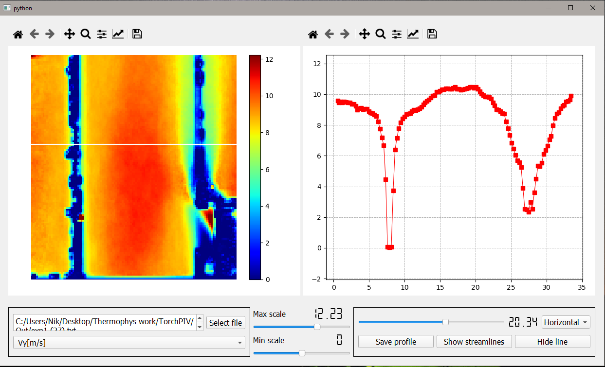

# Tool for PIV data visualisation
Simple GUI tool for visualistion of PIV data represented in text.

__Program description__:
Program for investigation of PIV vector fields data. With help of this tool one can create and save vertical or horizontal field profiles.
PIV data must be represented as text table with first two columns corresponding to X, Y 2d coordinates. For example:
| x[mm] | y[mm] | Vx[m/s]   | Vy[m/s]   |
|-------|-------|-----------|-----------|
| 0.3   | 0.5   | -0.084708 | -0.036295 |
| 0.4   | 0.5   | -0.053428 | -0.027506 |
| 0.6   | 0.5   | -0.082447 | -0.007336 |
| ...   | ...   | ...       | ...       |

